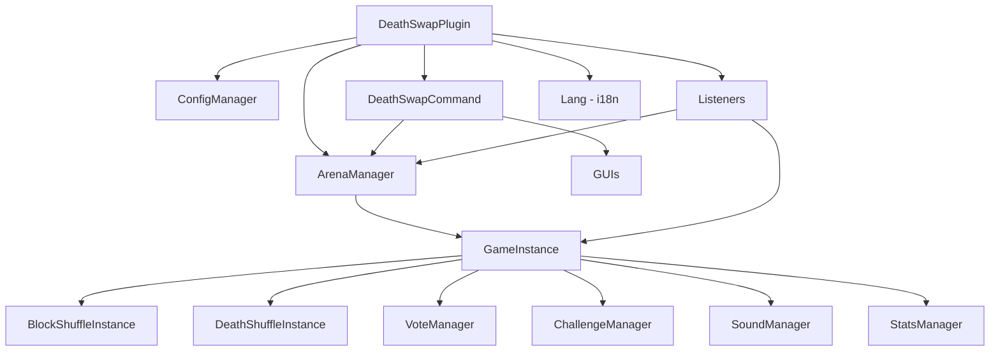
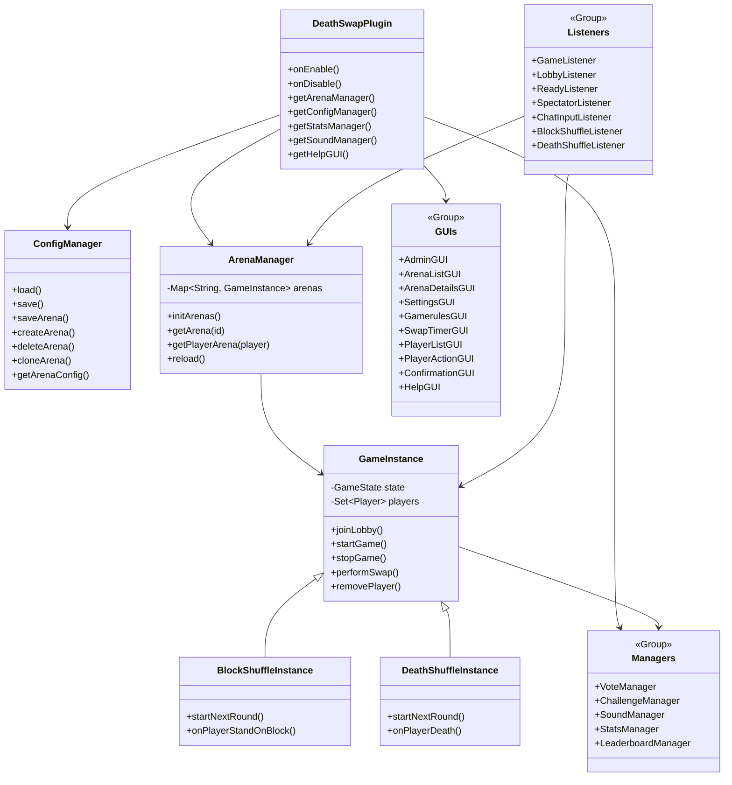

# 🎮 DeathSwap Plugin

> **[English Version](README_EN.md)**
>
> **Un plugin Minecraft professionnel** pour **Paper 1.21.11** (et forks compatibles : Purpur, etc.) avec 3 modes de jeu, multi-arènes, dashboard admin et personnalisation complète.
>
> **Note :** Le plugin supporte le **Français** et l'**Anglais** (configurable).
>
> ⚠️ **Non compatible Spigot/Bukkit** — Le plugin utilise l'API Adventure native de Paper.
> ⚠️ **Important :** Ce plugin a été conçu et testé pour **Minecraft 1.21.11** (gamerules en snake_case requises).

[](https://adoptium.net)
[](https://papermc.io)
[](LICENSE.md)

---

## ✨ Fonctionnalités

### 🕹️ 3 Modes de Jeu

| Mode                   | Description                                                                                                 |
| ---------------------- | ----------------------------------------------------------------------------------------------------------- |
| **DeathSwap**    | Les joueurs sont échangés aléatoirement. Piège la zone avant le swap !                                  |
| **DeathShuffle** | Meurs de la bonne façon pour survivre ! (Causes éditables en jeu via GUI, inclut sous-mode "Death Run" & "Morts Uniques") |
| **BlockShuffle** | Trouve et tiens-toi ou craft le bon bloc ! (Blocs éditables en jeu via GUI, inclut sous-mode "Item Race" & "Cibles Uniques") |

### 🏟️ Multi-Arènes

- Chaque arène est **indépendante** (monde, joueurs, config, timers)
- Plusieurs parties simultanées possibles
- Configuration par arène via des fichiers individuels dans `plugins/DeathSwap/arenas/`

### 🎛️ Dashboard Admin (`/ds admin`)

- Vue d'ensemble de toutes les arènes (`ArenaListGUI`)
- Configuration complète en jeu (`SettingsGUI`) : Mondes, Gamerules, Timers, etc.
- Force start/stop de jeux
- Régénération de monde (Multiverse ou Custom)
- Gestion des joueurs (kick, ban, teleport, inventaire)

### 🔧 Personnalisation Profonde

- **UI Mode** : RICH (BossBar + ActionBar) ou CLEAN (chat uniquement)
- **Gamerules** : Configurable en jeu via GUI ou commandes (dynamique et centré).
- **Sons** : Chaque événement sonore est configurable
- **Seeds** : Système de vote avec seeds prédéfinies et configuration par arène via le toggle custom-arena-seed-only.
- **Modes Shuffle Avancés** : GUI en jeu pour (dés)activer les blocs/causes, sous-modes "Course d'Item", "Cibles uniques", etc. Auto-découverte des nouveaux Blocs/Causes au lancement.
- **Anti-Solo Protection**: Prévention logicielle interdisant qu'un seul joueur soit bloqué indéfiniment. Fin automatique ou blocage de la partie.
- **API Custom Modes** : Intégration de `DeathSwapAPI.registerMode()` permettant aux développeurs tiers d'ajouter leurs propres modes de jeux via un plugin addon.
- **Challenges** : Craft, mine, kill avec récompenses (DeathSwap)
- **Commandes Configurables** : Téléportation et Reset de monde 100% configurables (support Vanilla/autres plugins)
- **Localisation** : Messages en Français et Anglais

### 📊 Statistiques

- Kills, morts, victoires, temps de jeu, parties jouées
- Leaderboards par catégorie (`/ds top`)
- Sauvegarde auto en YAML

---

## 📥 Installation

### Prérequis

| Composant       | Version | Requis                                                                |
| --------------- | ------- | --------------------------------------------------------------------- |
| Java            | 21+     | ✅                                                                    |
| Paper (ou fork) | 1.21.11 | ✅ Paper, Purpur, etc. — **pas** Spigot/Bukkit                       |
| Multiverse-Core | 4.x     | ⬜ Recommandé (gestion des mondes/TP) — peut être utilisé sans      |
| CyberWorldReset | *       | ⬜ Optionnel (régénération de monde)                                 |

### Installation

```bash
# 1. Build le plugin
mvn clean package

# 2. Copie le JAR dans le serveur
cp target/deathswap-1.0.0.jar /chemin/serveur/plugins/

# 3. Redémarre le serveur
# Les fichiers config.yml et arenas/example.yml seront générés automatiquement
```

### Configuration rapide

1. Crée un monde lobby via Multiverse : `mv create DS_WaitingLobby normal`
2. Crée un monde de jeu : `mv create DeathSwap_Game normal`
3. Copie `plugins/DeathSwap/arenas/example.yml` → `plugins/DeathSwap/arenas/default.yml`
4. Modifie `default.yml` avec tes mondes
5. `/ds reload` pour appliquer

---

## 📋 Commandes

### Joueur

| Commande                      | Description                                | Permission         |
| ----------------------------- | ------------------------------------------ | ------------------ |
| `/ds join [arène]`         | Rejoindre une arène (défaut:`default`) | `deathswap.play` |
| `/ds leave`                 | Quitter la partie en cours                 | `deathswap.play` |
| `/ds stats [joueur]`        | Voir les statistiques                      | `deathswap.play` |
| `/ds top [catégorie]`      | Classement (wins/kills/deaths/time/games)  | `deathswap.play` |
| `/ds vote <arène> <choix>` | Voter pour un seed                         | `deathswap.play` |
| `/ds help`                  | Affiche les commandes principales en chat  | `deathswap.play` |
| `/ds help gui`              | Ouvrir le menu d'aide visuel               | `deathswap.play` |
| `/ds list`                  | Liste des arènes et leur statut           | `deathswap.play` |
| `/ds tp <joueur>`           | TP vers un joueur (spectateur uniquement)  | `deathswap.play` |

### Admin

| Commande                                         | Description                                        | Permission          |
| ------------------------------------------------ | -------------------------------------------------- | ------------------- |
| `/ds start [debug]`                             | Lancer le jeu (debug = 1 joueur min)               | `deathswap.admin` |
| `/ds stop [arène]`                             | Arrêter une arène                                | `deathswap.admin` |
| `/ds swapnow`                                   | Forcer un swap immédiat                           | `deathswap.admin` |
| `/ds reload`                                    | Recharger la configuration                         | `deathswap.admin` |
| `/ds settings`                                  | Ouvrir le GUI Settings de l'arène courante        | `deathswap.admin` |
| `/ds help commands`                             | Affiche les commandes admin en chat                | `deathswap.admin` |
| `/ds admin`                                     | Ouvrir le Dashboard Admin (GUI)                    | `deathswap.admin` |
| `/ds admin list`                                | Lister les arènes (GUI)                           | `deathswap.admin` |
| `/ds admin create <nom>`                        | Créer une nouvelle arène                          | `deathswap.admin` |
| `/ds admin edit <arène>`                       | Ouvrir le GUI Settings d'une arène               | `deathswap.admin` |
| `/ds admin delete <nom>`                        | Supprimer une arène (avec confirmation)           | `deathswap.admin` |
| `/ds admin clone <src> <dst>`                   | Cloner une arène                                  | `deathswap.admin` |
| `/ds admin save`                                | Sauvegarder la configuration globale               | `deathswap.admin` |
| `/ds admin set <arène> <prop> <val>`           | Modifier une propriété d'arène                   | `deathswap.admin` |
| `/ds admin gamerule <arène> set/remove <r> [v]` | Modifier les gamerules                             | `deathswap.admin` |
| `/ds admin command <arène> tp/reset <val>`      | Configurer les commandes de TP/Reset               | `deathswap.admin` |

> **Alias :** `/deathswap` fonctionne aussi à la place de `/ds`

---

## ⚙️ Configuration

### Structure des fichiers

```
plugins/DeathSwap/
├── config.yml              # Configuration globale (hub, sons, stats, votes, challenges)
├── arenas/
│   ├── example.yml         # Arène de référence (ignorée par le plugin)
│   ├── default.yml         # Arène "default"
│   └── arena2.yml          # Autres arènes...
├── modes/
│   ├── blockshuffle.yml    # Blocs configurables pour BlockShuffle
│   └── deathshuffle.yml    # Causes de mort configurables pour DeathShuffle
└── stats/                  # Statistiques joueurs (YAML)
```

### `config.yml` (Configuration globale)

<details>
<summary><b>📂 Voir la configuration globale commentée</b></summary>

```yaml
# =========================================
#   DeathSwap Configuration
# =========================================

# World players are sent to when leaving / after game ends
hub-world: "MainLobby"

# Chat prefixes per game mode
prefixes:
  deathswap: "&8[&6DeathSwap&8]"
  deathshuffle: "&8[&dDeathShuffle&8]"
  blockshuffle: "&8[&bBlockShuffle&8]"

# =========================================
#   Features & Toggles
# =========================================

stats:
  enabled: true
  auto-save-minutes: 5

voting:
  enabled: true
  vote-time: 15
  options-count: 3

challenges:
  enabled: false # Default disabled as requested
  list:
    - { type: CRAFT, target: CRAFTING_TABLE, amount: 1, reward: SPEED, description: "Craft une table de craft" }
    - { type: MINE, target: COAL_ORE, amount: 3, reward: NIGHT_VISION, description: "Mine 3 charbons" }
    - { type: KILL, target: ZOMBIE, amount: 1, reward: STRENGTH, description: "Tue un zombie" }
    - { type: CRAFT, target: FURNACE, amount: 1, reward: FASTER_DIGGING, description: "Craft un four" }
    - { type: MINE, target: IRON_ORE, amount: 1, reward: RESISTANCE, description: "Trouve du fer" }

sounds:
  enabled: true
  game-start: { type: "ENTITY_ENDER_DRAGON_GROWL", volume: 1.0, pitch: 1.0 }
  countdown-tick: { type: "BLOCK_NOTE_BLOCK_HAT", volume: 1.0, pitch: 1.0 }
  countdown-go: { type: "ENTITY_EXPERIENCE_ORB_PICKUP", volume: 1.0, pitch: 1.2 }
  swap: { type: "ENTITY_ENDERMAN_TELEPORT", volume: 1.0, pitch: 1.0 }
  shuffle: { type: "BLOCK_NOTE_BLOCK_CHIME", volume: 1.0, pitch: 1.5 }
  death: { type: "ENTITY_WITHER_DEATH", volume: 0.5, pitch: 1.0 }
  win: { type: "UI_TOAST_CHALLENGE_COMPLETE", volume: 1.0, pitch: 1.0 }
  round-success: { type: "ENTITY_PLAYER_LEVELUP", volume: 1.0, pitch: 1.5 }
  round-fail: { type: "ENTITY_VILLAGER_NO", volume: 1.0, pitch: 0.8 }
  challenge-complete: { type: "ENTITY_PLAYER_LEVELUP", volume: 1.0, pitch: 1.5 }
  vote-cast:
    type: "UI_BUTTON_CLICK"
    volume: 1.0
    pitch: 1.0
```

</details>

### Fichier arène (`arenas/<id>.yml`)

  <details>
  <summary><b>📂 Voir la configuration d'arène commentée (example.yml)</b></summary>

```yaml
# ==========================================
#      DEATHSWAP ARENA CONFIGURATION
# ==========================================
# ID: example
# This file serves as a reference for all settings.

# Mode de jeu : DEATHSWAP, DEATHSHUFFLE, BLOCKSHUFFLE
game-type: DEATHSWAP

# Mondes (doivent être gérés par Multiverse)
game-world: "example_Game"
lobby-world: "example_Lobby"

# Joueurs
min-players: 2
max-players: 20
ui-mode: RICH  # RICH (BossBar + ActionBar) ou CLEAN (Chat uniquement)

# ==========================================
#                 TIMERS
# ==========================================
timers:
  load-time: 40           # Temps d'attente dans le lobby avant TP (secondes)
  swap-mode: FIXED        # FIXED (fixe) ou RANDOM (aléatoire)
  swap-interval: 300      # Temps entre les swaps (si FIXED)
  swap-min: 120           # Minimum temps de swap (si RANDOM)
  swap-max: 420           # Maximum temps de swap (si RANDOM)
  max-game-time: 1800     # Durée max de la partie (secondes). 0 = Illimité.
  spawn-protection: 30    # Invulnérabilité au début (secondes)

# ==========================================
#              ROUND TIMERS
# ==========================================
# Utilisés uniquement pour DeathShuffle / BlockShuffle
round-timers:
  easy: 90
  medium: 70
  hard: 50

# ==========================================
#              GAME RULES
# ==========================================
game:
  pvp-enabled: true
  nether-enabled: true
  end-enabled: true

# Règles classiques Minecraft (format Snake Case 1.21+)
gamerules:
  keep_inventory: "false"
  natural_health_regeneration: "true"
  mob_griefing: "true"
  do_fire_tick: "true"
  show_death_messages: "true"
  announce_advancements: "true" # (show_advancement_messages sur les anciennes versions)
  immediate_respawn: "true"
  random_tick_speed: "3" # (3 = défaut)

# ==========================================
#           STRUCTURES (SEEDS)
# ==========================================
# Liste des seeds disponibles pour la génération du monde
seeds:
  - seed: "-123456789"
    name: "Village Côtier"
  - seed: "987654321"
    name: "Montagnes Enneigées"
```

</details>

### Seeds Globaux (`seeds.yml`)

Les arènes peuvent utiliser leurs propres seeds (comme montré ci-dessus) ou piocher dans le fichier global `seeds.yml`. 
Ce fichier contient une grande collection de seeds par défaut (Villages, Temples, etc.) pour éviter d'avoir la même map à chaque partie.

```yaml
seeds:
  - seed: '8214184745'
    name: Portail en ruine & Temple Jungle 001
  - seed: '8554217320'
    name: Bateau & Portail 001
```

### 🏟️ Ajouter une arène

**Méthode 1 : Via fichier** — Copiez `arenas/example.yml` → `arenas/monarene.yml`, modifiez les valeurs, puis `/ds reload`.

**Méthode 2 : Via commande** — `/ds admin create monarene` puis éditez via le GUI Settings.

**Méthode 3 : Via clonage** — `/ds admin clone default monarene` pour dupliquer une arène existante.

---

## 🔐 Permissions

| Permission          | Description          | Défaut         |
| ------------------- | -------------------- | --------------- |
| `deathswap.play`  | Jouer au DeathSwap   | `true` (tous) |
| `deathswap.admin` | Accès admin complet | `op`          |

---

## 🎨 Modes d'Interface (UI Modes)

### RICH (défaut)

- **BossBar** pour le timer de swap/round
- **ActionBar** pour les infos en temps réel
- Titres visuels pour les events

### CLEAN

- Informations uniquement en **chat**
- Idéal pour les serveurs légers ou les joueurs qui préfèrent moins de HUD

Modifiable via :

- Fichier arène → `ui-mode: RICH` ou `CLEAN`
- In-game → GUI Settings (`/ds settings` ou `/ds admin edit <arène>`)

---

## 📊 Statistiques & Leaderboards

### Catégories trackées

| Stat            | Commande           |
| --------------- | ------------------ |
| Victoires       | `/ds top wins`   |
| Kills           | `/ds top kills`  |
| Morts           | `/ds top deaths` |
| Temps de jeu    | `/ds top time`   |
| Parties jouées | `/ds top games`  |

### Stockage

- Fichier YAML dans `plugins/DeathSwap/stats/`
- Sauvegarde auto configurable (`stats.auto-save-minutes`)

---

## 🎯 Challenges (DeathSwap uniquement)

Types disponibles :

- **CRAFT** – Fabriquer un objet
- **MINE** – Miner un bloc
- **KILL** – Tuer un mob

Récompenses = effets de potion (`SPEED`, `STRENGTH`, `NIGHT_VISION`, etc.)

Active-les dans `config.yml` → `challenges.enabled: true`

---

## 🗳️ Système de Vote

Quand activé, les joueurs votent pour un seed avant le début de la partie :

1. Le système propose `X` seeds aléatoires (configurable)
2. Les joueurs cliquent pour voter
3. Le seed gagnant est utilisé pour la génération du monde

---

## 🔊 Sons Personnalisés

Chaque événement sonore est configurable dans `config.yml` → `sounds.*`

| Événement             | Clé config            |
| ----------------------- | ---------------------- |
| Début de partie        | `game-start`         |
| Tick countdown          | `countdown-tick`     |
| Go !                    | `countdown-go`       |
| Swap                    | `swap`               |
| Shuffle (nouveau round) | `shuffle`            |
| Mort                    | `death`              |
| Victoire                | `win`                |
| Round réussi           | `round-success`      |
| Round échoué          | `round-fail`         |
| Challenge complété    | `challenge-complete` |
| Vote enregistré        | `vote-cast`          |

Désactive tous les sons : `sounds.enabled: false`

---

## 🛠️ Dashboard Admin

Accessible via `/ds admin` (permission `deathswap.admin`).

### Navigation

```
📋 Admin Dashboard
├── 🏟️ [Arène] (clic gauche → Détails, clic droit → TP lobby)
│   ├── ⚔️ Force Start / 🛑 Force Stop
│   ├── 💥 Régénérer Monde → ⚠ Confirmation
│   └── 👥 Gérer Joueurs
│       └── 👤 Actions Joueur
│           ├── 🔮 Téléporter
│           ├── 📦 Voir Inventaire
│           ├── 👢 Kick de l'Arène
│           └── ⛔ Bannir du Serveur → ⚠ Confirmation
├── ⭐ Recharger Config (Nether Star)
└── ❌ Fermer (Barrier)
```

> 💡 Les actions destructives (**Régénérer Monde** et **Bannir**) passent par un écran de confirmation "Êtes-vous sûr ?" pour éviter les erreurs.

---

## 🏗️ Architecture du Projet

```
src/main/java/be/dualsfwshield/deathswap/
├── DeathSwapPlugin.java      # Classe principale
├── GameInstance.java          # Logique de jeu (base)
├── GameState.java             # États (WAITING/STARTING/RUNNING/ENDED/DISABLED)
├── GameType.java              # Enum modes de jeu
├── SwapMode.java              # Enum FIXED/RANDOM
├── UIMode.java                # Enum RICH/CLEAN
├── SeedEntry.java             # Record seed prédéfini
├── ArenaManager.java          # Gestion multi-arènes
├── ConfigManager.java         # Configuration YAML
├── commands/
│   └── DeathSwapCommand.java  # Toutes les commandes /ds
├── gui/
│   ├── AdminGUI.java          # Dashboard admin
│   ├── ArenaListGUI.java      # Liste des arènes
│   ├── ArenaDetailsGUI.java   # Détails arène
│   ├── SettingsGUI.java       # Settings par arène
│   ├── GamerulesGUI.java      # Gamerules en jeu
│   ├── SwapTimerGUI.java      # Timer de swap
│   ├── PlayerListGUI.java     # Liste joueurs
│   ├── PlayerActionGUI.java   # Actions joueur
│   ├── ConfirmationGUI.java   # Confirmation actions destructives
│   ├── HelpGUI.java           # Menu d'aide visuel
│   └── GuiUtils.java          # Utilitaires GUI
├── listeners/
│   ├── GameListener.java      # Events Bukkit (mort, dégâts, etc.)
│   ├── LobbyListener.java     # Events lobby
│   ├── ReadyListener.java     # Toggle prêt dans le lobby
│   ├── ChatInputListener.java # Saisie texte via chat
│   └── SpectatorListener.java # Events spectateurs
├── modes/
│   ├── DeathShuffleInstance.java
│   ├── DeathShuffleListener.java
│   ├── DeathCause.java        # Enum causes de mort
│   ├── BlockShuffleInstance.java
│   └── BlockShuffleListener.java
├── stats/
│   ├── PlayerStats.java
│   ├── StatsManager.java
│   └── LeaderboardManager.java
├── challenges/
│   ├── Challenge.java
│   ├── ChallengeManager.java
│   └── ChallengeListener.java
├── vote/
│   └── VoteManager.java
├── sounds/
│   └── SoundManager.java
└── util/
    └── Lang.java              # Gestion i18n (FR/EN)
```

---

## 📄 Documentation Complète

📖 Voir [WIKI.md](WIKI.md) pour la documentation technique complète.

---

## 🏗️ Diagrammes

### Architecture Simplifiée



### Diagramme de Classes Complet



---

## 💻 API Développeurs (Custom Modes)

DeathSwap expose une API simple permettant aux développeurs tiers d'enregistrer leurs propres modes de jeux !
Vous avez besoin de créer une classe qui hérite de `GameInstance` et d'appeler `DeathSwapAPI.registerMode()`.

```java
import be.dualsfwshield.deathswap.api.DeathSwapAPI;
import be.dualsfwshield.deathswap.GameType;

// Dans le onEnable() de votre plugin addon:
DeathSwapAPI.registerMode(
    "MY_CUSTOM_MODE",            // ID Interne
    "My Custom Mode",            // Nom d'affichage
    "§8[§aMyMode§8]",            // Préfixe Chat
    MyCustomGameInstance::new    // Factory (Constructor Reference)
);
```

Vous pourrez alors écrire `game-type: MY_CUSTOM_MODE` dans vos arènes `/plugins/DeathSwap/arenas/arena1.yml`.

---

## 👤 Auteur

- **DualsFWShield** — [dualsfwshield.be](https://dualsfwshield.be) — [GitHub](https://github.com/DualsFWShield)

---

## 📝 Licence

Ce projet est sous licence personnalisée.

- **Utilisation et modification** : Libres (privé ou public).
- **Redistribution** : Autorisée avec crédit obligatoire.
- **Usage commercial** : Strictement interdit sans accord (voir [LICENSE.md](LICENSE.md)).
