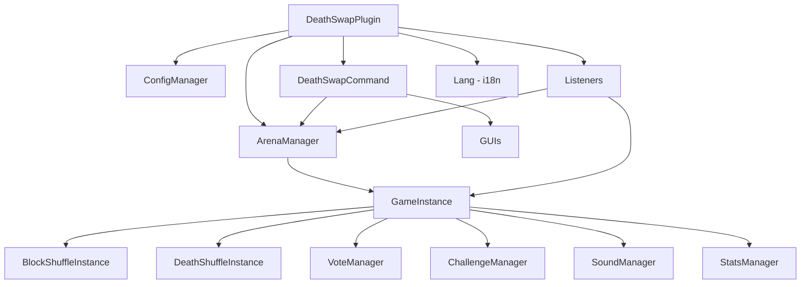
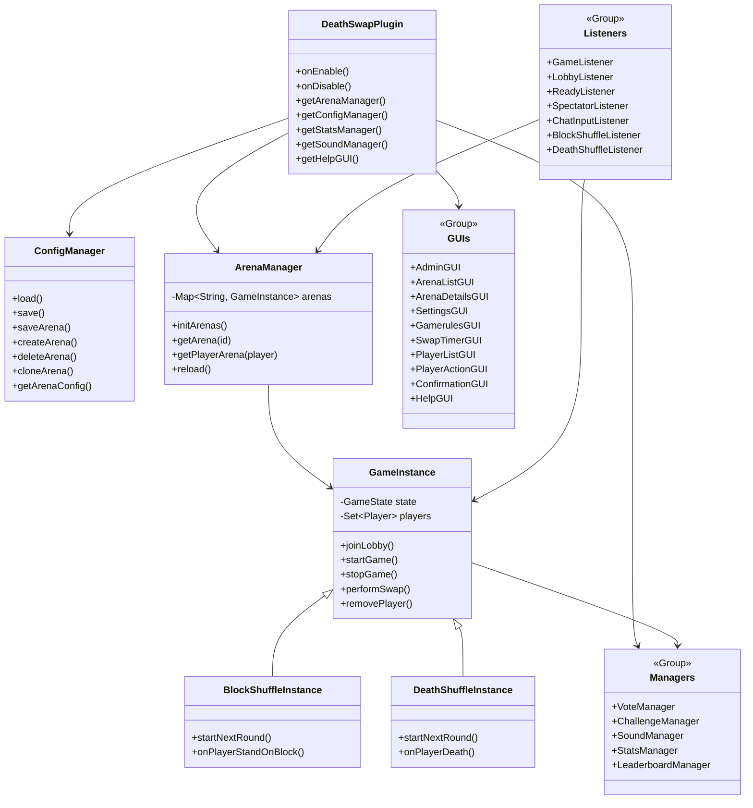

# 🎮 DeathSwap Plugin

> **[Version Française](README.md)**
>
> **A professional Minecraft plugin** for **Paper 1.21.11** (and compatible forks: Purpur, etc.) with 3 game modes, multi-arenas, admin dashboard and full customization.
>
> **Note:** The plugin supports **French** and **English** (configurable).
>
> ⚠️ **Not compatible with Spigot/Bukkit** — The plugin uses Paper's native Adventure API.
> ⚠️ **Important:** This plugin was designed and tested for **Minecraft 1.21.11** (snake_case gamerules required).

[](https://adoptium.net)
[](https://papermc.io)
[](LICENSE.md)

---

## ✨ Features

### 🕹️ 3 Game Modes

| Mode                   | Description                                                                                               |
| ---------------------- | --------------------------------------------------------------------------------------------------------- |
| **DeathSwap**    | Players are randomly swapped. Trap the area before the swap!                                          |
| **DeathShuffle** | Die the right way to survive! (Causes editable in-game via GUI, includes "Death Run" & "Unique Causes" sub-modes) |
| **BlockShuffle** | Find and stand or craft the correct block! (Blocks editable in-game via GUI, includes "Item Race" & "Unique Targets" sub-modes) |

### 🏟️ Multi-Arenas

- Each arena is **independent** (world, players, config, timers)
- Multiple simultaneous games possible
- Per-arena configuration via individual files in `plugins/DeathSwap/arenas/`

### 🎛️ Admin Dashboard (`/ds admin`)

- Overview of all arenas (`ArenaListGUI`)
- Full in-game configuration (`SettingsGUI`): Worlds, Gamerules, Timers, etc.
- Force start/stop games
- World regeneration (Multiverse or Custom)
- Player management (kick, ban, teleport, inventory)

### 🔧 Deep Customization

- **UI Mode**: RICH (BossBar + ActionBar) or CLEAN (chat only)
- **Gamerules**: Configurable in-game via GUI or commands
- **Sounds**: Every sound event is configurable
- **Seeds**: Voting system with predefined seeds
- **Advanced Shuffle Modes**: In-game GUI to toggle blocks/causes, sub-modes "Item Race", "Unique Targets", etc.
- **Challenges**: Craft, mine, kill with rewards (DeathSwap)
- **Configurable Commands**: Teleportation and World Reset fully configurable (Vanilla/other plugins support)
- **Localization**: Messages in French and English

### 📊 Statistics

- Kills, deaths, wins, play time, games played
- Leaderboards by category (`/ds top`)
- Auto-save in YAML

---

## 📥 Installation

### Prerequisites

| Component       | Version | Required                                                            |
| --------------- | ------- | ------------------------------------------------------------------- |
| Java            | 21+     | ✅                                                                  |
| Paper (or fork) | 1.21.11 | ✅ Paper, Purpur, etc. — **not** Spigot/Bukkit                     |
| Multiverse-Core | 4.x     | ⬜ Recommended (world management/TP) — can be used without        |
| CyberWorldReset | *       | ⬜ Optional (world regeneration)                                   |

### Installation

```bash
# 1. Build the plugin
mvn clean package

# 2. Copy the JAR to the server
cp target/deathswap-1.0.0.jar /path/to/server/plugins/

# 3. Restart the server
# config.yml and arenas/example.yml will be generated automatically
```

### Quick Setup

1. Create a lobby world via Multiverse: `mv create DS_WaitingLobby normal`
2. Create a game world: `mv create DeathSwap_Game normal`
3. Copy `plugins/DeathSwap/arenas/example.yml` → `plugins/DeathSwap/arenas/default.yml`
4. Edit `default.yml` with your worlds
5. `/ds reload` to apply

---

## 📋 Commands

### Player

| Command                       | Description                               | Permission         |
| ----------------------------- | ----------------------------------------- | ------------------ |
| `/ds join [arena]`          | Join an arena (default: `default`)       | `deathswap.play` |
| `/ds leave`                  | Leave the current game                    | `deathswap.play` |
| `/ds stats [player]`         | View statistics                           | `deathswap.play` |
| `/ds top [category]`         | Leaderboard (wins/kills/deaths/time/games)| `deathswap.play` |
| `/ds vote <arena> <choice>`  | Vote for a seed                           | `deathswap.play` |
| `/ds help`                   | Display main commands in chat             | `deathswap.play` |
| `/ds help gui`               | Open the visual help menu                 | `deathswap.play` |
| `/ds list`                   | List arenas and their status              | `deathswap.play` |
| `/ds tp <player>`            | TP to a player (spectator only)           | `deathswap.play` |

### Admin

| Command                                          | Description                                        | Permission          |
| ------------------------------------------------ | -------------------------------------------------- | ------------------- |
| `/ds start [debug]`                             | Start game (debug = 1 player min)                  | `deathswap.admin` |
| `/ds stop [arena]`                              | Stop an arena                                      | `deathswap.admin` |
| `/ds swapnow`                                   | Force an immediate swap                            | `deathswap.admin` |
| `/ds reload`                                    | Reload configuration                               | `deathswap.admin` |
| `/ds settings`                                  | Open Settings GUI for current arena                | `deathswap.admin` |
| `/ds help commands`                             | Display admin commands in chat                     | `deathswap.admin` |
| `/ds admin`                                     | Open the Admin Dashboard (GUI)                     | `deathswap.admin` |
| `/ds admin list`                                | List arenas (GUI)                                  | `deathswap.admin` |
| `/ds admin create <name>`                       | Create a new arena                                 | `deathswap.admin` |
| `/ds admin edit <arena>`                        | Open Settings GUI for an arena                     | `deathswap.admin` |
| `/ds admin delete <name>`                       | Delete an arena (with confirmation)                | `deathswap.admin` |
| `/ds admin clone <src> <dst>`                   | Clone an arena                                     | `deathswap.admin` |
| `/ds admin save`                                | Save global configuration                          | `deathswap.admin` |
| `/ds admin set <arena> <prop> <val>`            | Modify an arena property                           | `deathswap.admin` |
| `/ds admin gamerule <arena> set/remove <r> [v]` | Modify gamerules                                   | `deathswap.admin` |
| `/ds admin command <arena> tp/reset <val>`      | Configure TP/Reset commands                        | `deathswap.admin` |

> **Alias:** `/deathswap` works as well instead of `/ds`

---

## ⚙️ Configuration

### File Structure

```
plugins/DeathSwap/
├── config.yml              # Global config (hub, sounds, stats, votes, challenges)
├── arenas/
│   ├── example.yml         # Reference arena (ignored by the plugin)
│   ├── default.yml         # "default" arena
│   └── arena2.yml          # Other arenas...
├── modes/
│   ├── blockshuffle.yml    # Configurable blocks for BlockShuffle
│   └── deathshuffle.yml    # Configurable death causes for DeathShuffle
└── stats/                  # Player statistics (YAML)
```

### `config.yml` (Global Configuration)

<details>
<summary><b>📂 View the commented global configuration</b></summary>

```yaml
# =========================================
#   DeathSwap Global Configuration
# =========================================

# World players are sent to after game/kick
hub-world: "MainLobby"

# Teleport command.
# Placeholders: %player%, %world%, %x%, %y%, %z%, %yaw%, %pitch%
# Default (Multiverse): "mvtp %player% e:%world%:%x%,%y%,%z%:%yaw%:%pitch%"
# Vanilla: "execute in %world% run tp %player% %x% %y% %z% %yaw% %pitch%"
teleport-command: "mvtp %player% e:%world%:%x%,%y%,%z%:%yaw%:%pitch%"

# Commands used to reset the game world before a match.
# Placeholders: %world%, %seed%
# Empty list [] = no reset (static map).
world-reset-commands:
  - "cwr edit %world% setSeed %seed%"
  - "cwr reset %world%"

# Chat prefixes per game mode
prefixes:
  deathswap: "§8[§6DeathSwap§8]"
  deathshuffle: "§8[§dDeathShuffle§8]"
  blockshuffle: "§8[§bBlockShuffle§8]"

# =========================================
#   Features & Toggles
# =========================================

# Statistics system
stats:
  enabled: true             # Enable statistics
  auto-save-minutes: 5      # Auto-save interval (minutes)

# Seed voting system
voting:
  enabled: true             # Enable voting
  vote-time: 15             # Voting duration in seconds
  options-count: 3          # Number of seed choices shown

# Challenges (DeathSwap only)
challenges:
  enabled: false            # Enable challenges
  list:
    - { type: CRAFT, target: CRAFTING_TABLE, amount: 1, reward: SPEED, description: "Craft a Workbench" }
    - { type: MINE, target: COAL_ORE, amount: 3, reward: NIGHT_VISION, description: "Mine 3 coal ores" }
    - { type: KILL, target: ZOMBIE, amount: 1, reward: STRENGTH, description: "Kill a zombie" }

# Custom sounds
sounds:
  enabled: true
  game-start: { type: "ENTITY_ENDER_DRAGON_GROWL", volume: 1.0, pitch: 1.0 }
  countdown-tick: { type: "BLOCK_NOTE_BLOCK_HAT", volume: 1.0, pitch: 1.0 }
  countdown-go: { type: "ENTITY_EXPERIENCE_ORB_PICKUP", volume: 1.0, pitch: 1.2 }
  swap: { type: "ENTITY_ENDERMAN_TELEPORT", volume: 1.0, pitch: 1.0 }
  shuffle: { type: "BLOCK_NOTE_BLOCK_CHIME", volume: 1.0, pitch: 1.5 }
  death: { type: "ENTITY_WITHER_DEATH", volume: 0.5, pitch: 1.0 }
  win: { type: "UI_TOAST_CHALLENGE_COMPLETE", volume: 1.0, pitch: 1.0 }
  round-success: { type: "ENTITY_PLAYER_LEVELUP", volume: 1.0, pitch: 1.5 }
  round-fail: { type: "ENTITY_VILLAGER_NO", volume: 1.0, pitch: 0.8 }
  challenge-complete: { type: "ENTITY_PLAYER_LEVELUP", volume: 1.0, pitch: 1.5 }
  vote-cast: { type: "ENTITY_UI_BUTTON_CLICK", volume: 1.0, pitch: 2.0 }
```

</details>

### Arena File (`arenas/<id>.yml`)

<details>
<summary><b>📂 View the commented arena configuration (example.yml)</b></summary>

```yaml
# ==========================================
#      DEATHSWAP ARENA CONFIGURATION
# ==========================================
# Reference file. Copy this to create a
# new arena (e.g., default.yml).

# Game mode: DEATHSWAP, DEATHSHUFFLE, BLOCKSHUFFLE
game-type: DEATHSWAP

# Worlds (must be managed by Multiverse or exist on the server)
game-world: "example_Game"
lobby-world: "example_Lobby"

# Player limits
min-players: 2
max-players: 20

# Interface mode: RICH (BossBar + ActionBar) or CLEAN (Chat only)
ui-mode: RICH

# ==========================================
#                 TIMERS
# ==========================================
timers:
  load-time: 40           # Lobby wait time before TP (seconds)
  swap-mode: FIXED        # FIXED or RANDOM
  swap-interval: 300      # Time between swaps if FIXED (seconds)
  swap-min: 120           # Min swap time if RANDOM (seconds)
  swap-max: 420           # Max swap time if RANDOM (seconds)
  max-game-time: 1800     # Max game duration (seconds). 0 = Unlimited
  spawn-protection: 30    # Invulnerability + Slow Falling at start (seconds)

# ==========================================
#              ROUND TIMERS
# ==========================================
# Used for DeathShuffle / BlockShuffle only
round-timers:
  easy: 90
  medium: 70
  hard: 50

# ==========================================
#             GAME RULES
# ==========================================
game:
  pvp-enabled: true       # PvP between players
  nether-enabled: true    # Nether access
  end-enabled: true       # End access

# Minecraft gamerules (snake_case format)
gamerules:
  keep_inventory: "false"
  immediate_respawn: "true"
  do_daylight_cycle: "true"
  do_weather_cycle: "true"
  mob_griefing: "true"
  natural_regeneration: "true"
  do_mob_spawning: "true"
  send_command_feedback: "false"
  log_admin_commands: "false"
  spawn_radius: "0"
  random_tick_speed: "3"
  announce_advancements: "true"

# ==========================================
#           ADVANCED OPTIONS
# ==========================================

# Resilience: robust start
start-if-min-players-met: false       # Ignore "Not Ready" if min reached
prevent-cancel-after-countdown: false # Continue even if a player leaves

# Per-arena command overrides (null = use global default)
# teleport-command: "mvtp %player% e:%world%:%x%,%y%,%z%:%yaw%:%pitch%"
# world-reset-commands:
#   - "cwr edit %world% setSeed %seed%"
#   - "cwr reset %world%"

# ==========================================
#               SEEDS
# ==========================================
seeds:
  - seed: "-123456789"
    name: "Coastal Village"
  - seed: "987654321"
    name: "Snowy Mountains"
```

</details>

### 🏟️ Adding an Arena

**Method 1: Via file** — Copy `arenas/example.yml` → `arenas/myarena.yml`, edit the values, then `/ds reload`.

**Method 2: Via command** — `/ds admin create myarena` then edit via the Settings GUI.

**Method 3: Via cloning** — `/ds admin clone default myarena` to duplicate an existing arena.

---

## 🔐 Permissions

| Permission          | Description         | Default         |
| ------------------- | ------------------- | --------------- |
| `deathswap.play`  | Play DeathSwap      | `true` (all)  |
| `deathswap.admin` | Full admin access   | `op`          |

---

## 🎨 Interface Modes (UI Modes)

### RICH (default)

- **BossBar** for swap/round timer
- **ActionBar** for real-time info
- Visual titles for events

### CLEAN

- Information via **chat** only
- Ideal for lightweight servers or players who prefer less HUD

Modifiable via:

- Arena file → `ui-mode: RICH` or `CLEAN`
- In-game → Settings GUI (`/ds settings` or `/ds admin edit <arena>`)

---

## 📊 Statistics & Leaderboards

### Tracked Stats

| Stat         | Command            |
| ------------ | ------------------ |
| Wins         | `/ds top wins`   |
| Kills        | `/ds top kills`  |
| Deaths       | `/ds top deaths` |
| Play time    | `/ds top time`   |
| Games played | `/ds top games`  |

### Storage

- YAML file in `plugins/DeathSwap/stats/`
- Configurable auto-save (`stats.auto-save-minutes`)

---

## 🎯 Challenges (DeathSwap only)

Available types:

- **CRAFT** – Craft an item
- **MINE** – Mine a block
- **KILL** – Kill a mob

Rewards = potion effects (`SPEED`, `STRENGTH`, `NIGHT_VISION`, etc.)

Enable in `config.yml` → `challenges.enabled: true`

---

## 🗳️ Voting System

When enabled, players vote for a seed before the game starts:

1. The system proposes `X` random seeds (configurable)
2. Players click to vote
3. The winning seed is used for world generation

---

## 🔊 Custom Sounds

Every sound event is configurable in `config.yml` → `sounds.*`

| Event              | Config key             |
| -------------------- | ---------------------- |
| Game start           | `game-start`         |
| Countdown tick       | `countdown-tick`     |
| Go!                  | `countdown-go`       |
| Swap                 | `swap`               |
| Shuffle (new round)  | `shuffle`            |
| Death                | `death`              |
| Win                  | `win`                |
| Round success        | `round-success`      |
| Round fail           | `round-fail`         |
| Challenge completed  | `challenge-complete` |
| Vote cast            | `vote-cast`          |

Disable all sounds: `sounds.enabled: false`

---

## 🛠️ Admin Dashboard

Accessible via `/ds admin` (permission `deathswap.admin`).

### Navigation

```
📋 Admin Dashboard
├── 🏟️ [Arena] (left-click → Details, right-click → TP to lobby)
│   ├── ⚔️ Force Start / 🛑 Force Stop
│   ├── 💥 Regenerate World → ⚠ Confirmation
│   └── 👥 Manage Players
│       └── 👤 Player Actions
│           ├── 🔮 Teleport
│           ├── 📦 View Inventory
│           ├── 👢 Kick from Arena
│           └── ⛔ Ban from Server → ⚠ Confirmation
├── ⭐ Reload Config (Nether Star)
└── ❌ Close (Barrier)
```

> 💡 Destructive actions (**Regenerate World** and **Ban**) go through a confirmation screen to prevent mistakes.

---

## 🏗️ Project Architecture

```
src/main/java/be/dualsfwshield/deathswap/
├── DeathSwapPlugin.java      # Main class
├── GameInstance.java          # Game logic (base)
├── GameState.java             # States (WAITING/STARTING/RUNNING/ENDED/DISABLED)
├── GameType.java              # Game mode enum
├── SwapMode.java              # FIXED/RANDOM enum
├── UIMode.java                # RICH/CLEAN enum
├── SeedEntry.java             # Predefined seed record
├── ArenaManager.java          # Multi-arena management
├── ConfigManager.java         # YAML configuration
├── commands/
│   └── DeathSwapCommand.java  # All /ds commands
├── gui/
│   ├── AdminGUI.java          # Admin dashboard
│   ├── ArenaListGUI.java      # Arena list
│   ├── ArenaDetailsGUI.java   # Arena details
│   ├── SettingsGUI.java       # Per-arena settings
│   ├── GamerulesGUI.java      # In-game gamerules
│   ├── SwapTimerGUI.java      # Swap timer
│   ├── PlayerListGUI.java     # Player list
│   ├── PlayerActionGUI.java   # Player actions
│   ├── ConfirmationGUI.java   # Destructive action confirmation
│   ├── HelpGUI.java           # Visual help menu
│   └── GuiUtils.java          # GUI utilities
├── listeners/
│   ├── GameListener.java      # Bukkit events (death, damage, etc.)
│   ├── LobbyListener.java     # Lobby events
│   ├── ReadyListener.java     # Ready toggle in lobby
│   ├── ChatInputListener.java # Text input via chat
│   └── SpectatorListener.java # Spectator events
├── modes/
│   ├── DeathShuffleInstance.java
│   ├── DeathShuffleListener.java
│   ├── DeathCause.java        # Death cause enum
│   ├── BlockShuffleInstance.java
│   └── BlockShuffleListener.java
├── stats/
│   ├── PlayerStats.java
│   ├── StatsManager.java
│   └── LeaderboardManager.java
├── challenges/
│   ├── Challenge.java
│   ├── ChallengeManager.java
│   └── ChallengeListener.java
├── vote/
│   └── VoteManager.java
├── sounds/
│   └── SoundManager.java
└── util/
    └── Lang.java              # i18n management (FR/EN)
```

---

## 📄 Full Documentation

📖 See [WIKI_EN.md](WIKI_EN.md) for the complete technical documentation.

---

## 🏗️ Diagrams

### Simplified Architecture



### Complete Class Diagram



---

## 👤 Author

- **DualsFWShield** — [dualsfwshield.be](https://dualsfwshield.be) — [GitHub](https://github.com/DualsFWShield)

---

## 📝 License

This project is under a custom license.

- **Usage and Modification**: Free (private or public).
- **Redistribution**: Allowed with mandatory credit.
- **Commercial Use**: Strictly prohibited without prior agreement (see [LICENSE.md](LICENSE.md)).
