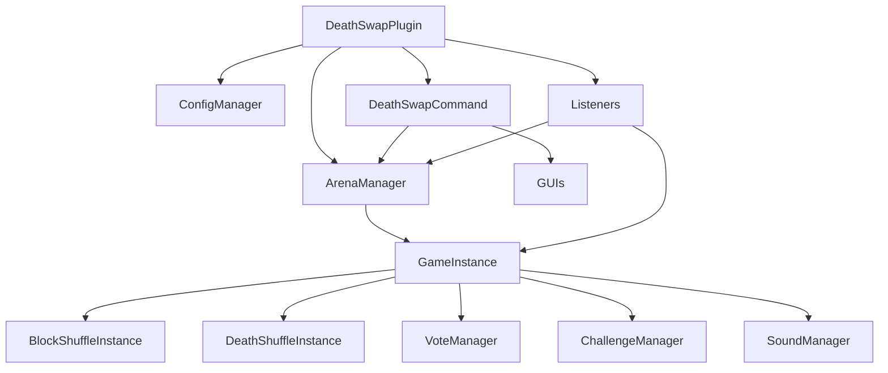
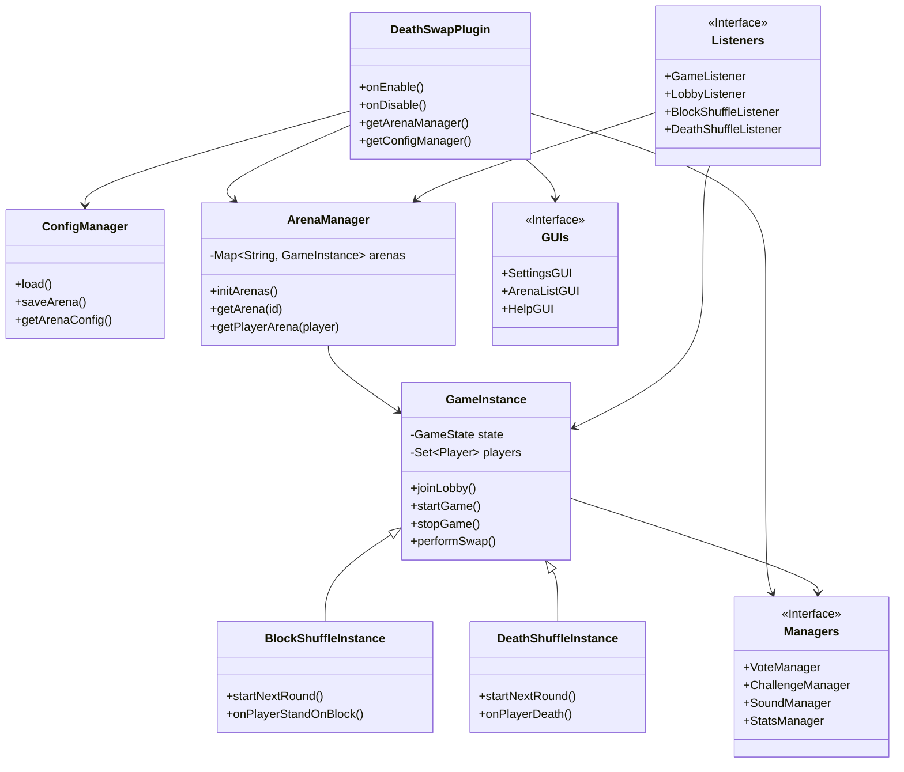

# 🎮 DeathSwap Plugin

> **[Version Française](README.md)**
>
> **A professional Minecraft plugin** for Paper 1.21+ with 3 game modes, multi-arenas, admin dashboard, and full customization.
>
> ⚠️ **Note:** In-game messages are currently in **French** only.

[](https://adoptium.net)
[](https://papermc.io)
[](LICENSE.md)

---

## ✨ Features

### 🕹️ 3 Game Modes
| Mode | Description |
|------|-------------|
| **DeathSwap** | Players swapped randomly. Trap the area before the swap! |
| **DeathShuffle** | Each round, a death type is assigned. Die the correct way to survive! |
| **BlockShuffle** | Find and stand on the correct block before the timer runs out! |

### 🏟️ Multi-Arenas
- Each arena is **independent** (world, players, config, timers)
- Multiple simultaneous games possible
- Per-arena configuration via `config.yml`

### 🎛️ Admin Dashboard (`/ds admin`)
- Overview of all arenas (`ArenaListGUI`)
- Full in-game configuration (`SettingsGUI`): Worlds, Gamerules, Timers, etc.
- Force start/stop games
- World regeneration (Multiverse or Custom)
- Player management (kick, ban, teleport, inventory)

### 🔧 Deep Customization
- **UI Mode**: RICH (BossBar + ActionBar) or CLEAN (chat only)
- **Gamerules**: Configurable in-game via GUI
- **Sounds**: Every sound event is configurable
- **Seeds**: Voting system with predefined seeds
- **Challenges**: Craft, mine, kill with rewards (DeathSwap)
- **Configurable Commands**: Teleportation and World Reset are 100% configurable (Vanilla/other plugin support)

### 📊 Statistics
- Kills, deaths, wins, play time, games played
- Leaderboards per category (`/ds top`)
- Auto-save to YAML

---

## 📥 Installation

### Prerequisites
| Component | Version | Required |
|-----------|---------|----------|
| Java | 21+ | ✅ |
| Paper | 1.21+ | ✅ |
| Multiverse-Core | 4.x | ✅ |
| CyberWorldReset | * | ⬜ Optional |

### Installation
```bash
# 1. Build the plugin
mvn clean package

# 2. Copy the JAR to the server
cp target/deathswap-1.0.0.jar /path/to/server/plugins/

# 3. Restart the server
# The config.yml file will be generated automatically
```

### Quick Configuration
1. Create a lobby world via Multiverse: `mv create DS_WaitingLobby normal`
2. Create a game world: `mv create DeathSwap_Game normal`
3. Configure `plugins/DeathSwap/config.yml` (see below)
4. `/ds reload` to apply

---

## 📋 Commands

### Player
| Command | Description | Permission |
|---------|-------------|------------|
| `/ds join [arena]` | Join an arena (default: `default`) | `deathswap.play` |
| `/ds leave` | Leave current game | `deathswap.play` |
| `/ds stats [player]` | View statistics | `deathswap.play` |
| `/ds top [category]` | Leaderboard (wins/kills/deaths/time/games) | `deathswap.play` |
| `/ds vote <arena> <choice>` | Vote for a seed | `deathswap.play` |
| `/ds list` | List arenas and their status | `deathswap.play` |
| `/ds tp <player>` | TP to a player (spectator only) | `deathswap.play` |

### Admin
| Command | Description | Permission |
|---------|-------------|------------|
| `/ds start [debug]` | Start game (debug = 1 min player) | `deathswap.admin` |
| `/ds stop [arena]` | Stop an arena | `deathswap.admin` |
| `/ds swapnow` | Force immediate swap | `deathswap.admin` |
| `/ds reload` | Reload configuration | `deathswap.admin` |
| `/ds admin` | Open Admin Dashboard (GUI) | `deathswap.admin` |
| `/ds admin set <arena> <prop> <val>` | Modify a property (lobby, game, gametype...) | `deathswap.admin` |
| `/ds admin gamerule <arena> ...` | Modify gamerules | `deathswap.admin` |
| `/ds admin command <arena> ...` | Configure TP/Reset commands | `deathswap.admin` |
| `/ds admin create/delete/clone` | Arena management | `deathswap.admin` |

---

## ⚙️ Configuration (`config.yml`)

<details>
<summary><b>📂 View full commented configuration</b></summary>

```yaml
# =========================================
#   DeathSwap Configuration
# =========================================

# Hub world (return after game/kick)
hub-world: "MainLobby"

# Configurable commands (default values for Multiverse/CyberWorldReset)
teleport-command: "mvtp %player% e:%world%:%x%,%y%,%z%:%yaw%:%pitch%"
world-reset-commands:
  - "cwr edit %world% setSeed %seed%"
  - "cwr reset %world%"

# Chat prefixes per game mode
prefixes:
  deathswap: "&8[&6DeathSwap&8]"
  deathshuffle: "&8[&dDeathShuffle&8]"
  blockshuffle: "&8[&bBlockShuffle&8]"

# =========================================
#   Features & Toggles
# =========================================

stats:
  enabled: true           # Enable statistics system
  auto-save-minutes: 5    # Auto-save interval (minutes)

voting:
  enabled: true           # Enable seed voting
  vote-time: 15           # Vote duration in seconds
  options-count: 3        # Number of choices proposed

challenges:
  enabled: false          # Enable challenges (DeathSwap only)
  list:
    - { type: CRAFT, target: CRAFTING_TABLE, amount: 1, reward: SPEED, description: "Craft a workbench" }
    - { type: MINE, target: COAL_ORE, amount: 3, reward: NIGHT_VISION, description: "Mine 3 coal" }
    - { type: KILL, target: ZOMBIE, amount: 1, reward: STRENGTH, description: "Kill a zombie" }

sounds:
  enabled: true
  game-start: { type: "ENTITY_ENDER_DRAGON_GROWL", volume: 1.0, pitch: 1.0 }
  countdown-tick: { type: "BLOCK_NOTE_BLOCK_HAT", volume: 1.0, pitch: 1.0 }
  countdown-go: { type: "ENTITY_EXPERIENCE_ORB_PICKUP", volume: 1.0, pitch: 1.2 }
  swap: { type: "ENTITY_ENDERMAN_TELEPORT", volume: 1.0, pitch: 1.0 }
  shuffle: { type: "BLOCK_NOTE_BLOCK_CHIME", volume: 1.0, pitch: 1.5 }
  death: { type: "ENTITY_WITHER_DEATH", volume: 0.5, pitch: 1.0 }
  win: { type: "UI_TOAST_CHALLENGE_COMPLETE", volume: 1.0, pitch: 1.0 }
  round-success: { type: "ENTITY_PLAYER_LEVELUP", volume: 1.0, pitch: 1.5 }
  round-fail: { type: "ENTITY_VILLAGER_NO", volume: 1.0, pitch: 0.8 }
  challenge-complete: { type: "ENTITY_PLAYER_LEVELUP", volume: 1.0, pitch: 1.5 }
  vote-cast: { type: "ENTITY_UI_BUTTON_CLICK", volume: 1.0, pitch: 2.0 }

# =========================================
#   Arenas (each arena = independent game)
# =========================================
arenas:
  default:
    # --- Game Mode ---
    # DEATHSWAP, DEATHSHUFFLE, BLOCKSHUFFLE
    game-type: DEATHSWAP

    # --- Worlds (Multiverse) ---
    game-world: "DeathSwap_Game"
    lobby-world: "DS_WaitingLobby"

    # --- Player Limits ---
    min-players: 2
    max-players: 20

    # --- UI Mode ---
    # RICH = BossBar + ActionBar | CLEAN = Chat only
    ui-mode: RICH

    # --- Timers (seconds) ---
    timers:
      load-time: 40              # World load time
      swap-mode: FIXED           # FIXED or RANDOM
      swap-interval: 300         # FIXED mode: exact interval (sec)
      swap-min: 120              # RANDOM mode: min interval
      swap-max: 420              # RANDOM mode: max interval
      max-game-time: 1800        # Max game duration (30 min)
      spawn-protection: 30       # Start invulnerability + Slow Falling (sec)

    # --- Round Timers (DeathShuffle / BlockShuffle) ---
    round-timers:
      easy: 90
      medium: 70
      hard: 50

    # --- Game Rules ---
    game:
      pvp-enabled: true
      nether-enabled: false
      end-enabled: false

    # --- Minecraft Gamerules ---
    gamerules:
      keepInventory: "false"
      immediateRespawn: "true"
      doDaylightCycle: "true"
      doWeatherCycle: "true"
      mobGriefing: "true"
      naturalRegeneration: "true"
      doMobSpawning: "true"
      random_tick_speed: "3"
      show_advancement_messages: "true"

    # --- Predefined Seeds ---
    seeds:
      - { seed: "-3542283819777", name: "Temple & Village" }
      - { seed: "8490605437877207559", name: "Village & Ice Spikes" }
      - { seed: "-13377777", name: "Desert & Pyramid" }
      - { seed: "123456789", name: "Survival Island" }
      - { seed: "-69420", name: "Mansion" }
```

</details>

### 🏟️ Adding an Arena

To add a second arena, duplicate the block under `arenas:`:

```yaml
arenas:
  default:
    game-type: DEATHSWAP
    game-world: "DeathSwap_Game"
    lobby-world: "DS_WaitingLobby"
    # ...

  arena2:
    game-type: DEATHSHUFFLE
    game-world: "DS_Game_2"
    lobby-world: "DS_Lobby_2"
    min-players: 2
    max-players: 10
    ui-mode: CLEAN
    timers:
      load-time: 30
      swap-mode: RANDOM
      swap-min: 60
      swap-max: 180
    round-timers:
      easy: 120
      medium: 90
      hard: 60
    game:
      pvp-enabled: false
      nether-enabled: true
    seeds:
      - { seed: "42", name: "The Answer" }
```

Then create the worlds via Multiverse: `mv create DS_Game_2 normal` and `mv create DS_Lobby_2 normal`.

---

## 🔐 Permissions

| Permission | Description | Default |
|------------|-------------|---------|
| `deathswap.play` | Play DeathSwap | `true` (all) |
| `deathswap.admin` | Full admin access | `op` |

---

## 🎨 Interface Modes (UI Modes)

### RICH (default)
- **BossBar** for swap/round timer
- **ActionBar** for real-time info
- Visual titles for events

### CLEAN
- Information only in **chat**
- Ideal for lightweight servers or players who prefer less HUD

Change via:
- `config.yml` → `ui-mode: RICH` or `CLEAN`
- In-game → Settings GUI (`/ds settings` per arena)

---

## 📊 Statistics & Leaderboards

### Tracked Categories
| Stat | Command |
|------|---------|
| Wins | `/ds top wins` |
| Kills | `/ds top kills` |
| Deaths | `/ds top deaths` |
| Play Time | `/ds top time` |
| Games Played | `/ds top games` |

### Storage
- YAML file in `plugins/DeathSwap/stats/`
- Configurable auto-save (`stats.auto-save-minutes`)

---

## 🎯 Challenges (DeathSwap only)

Available types:
- **CRAFT** – Craft an item
- **MINE** – Mine a block
- **KILL** – Kill a mob

Rewards = potion effects (`SPEED`, `STRENGTH`, `NIGHT_VISION`, etc.)

Enable them in `config.yml` → `challenges.enabled: true`

---

## 🗳️ Voting System

When enabled, players vote for a seed before game start:
1. The system proposes `X` random seeds (configurable)
2. Players click to vote
3. Video winning seed is used for world generation

---

## 🔊 Custom Sounds

Every sound event is configurable in `config.yml` → `sounds.*`

| Event | Config Key |
|-------|------------|
| Game start | `game-start` |
| Tick countdown | `countdown-tick` |
| Go ! | `countdown-go` |
| Swap | `swap` |
| Shuffle (new round) | `shuffle` |
| Death | `death` |
| Win | `win` |
| Round success | `round-success` |
| Round fail | `round-fail` |
| Challenge completed | `challenge-complete` |
| Vote cast | `vote-cast` |

Disable all sounds: `sounds.enabled: false`

---

## 🛠️ Admin Dashboard

Accessible via `/ds admin` (permission `deathswap.admin`).

### Navigation
```
📋 Admin Dashboard
├── 🏟️ [Arena] (left click → Details, right click → TP lobby)
│   ├── ⚔️ Force Start / 🛑 Force Stop
│   ├── 💥 Regenerate World (CyberWorldReset) → ⚠ Confirmation
│   └── 👥 Manage Players
│       └── 👤 Player Actions
│           ├── 🔮 Teleport
│           ├── 📦 View Inventory
│           ├── 👢 Kick from Arena
│           └── ⛔ Ban from Server → ⚠ Confirmation
├── ⭐ Reload Config (Nether Star)
└── ❌ Close (Barrier)
```

> 💡 Destructive actions (**Regenerate World** and **Ban**) have an "Are you sure?" confirmation screen to prevent errors.

---

## 🏗️ Project Architecture

```
src/main/java/be/dualsfwshield/deathswap/
├── DeathSwapPlugin.java      # Main class
├── GameInstance.java          # Game logic (base)
├── GameState.java             # States (WAITING/STARTING/RUNNING/ENDED/DISABLED)
├── ArenaManager.java          # Multi-arena management
├── ConfigManager.java         # YAML Configuration
├── commands/
│   └── DeathSwapCommand.java  # All /ds commands
├── gui/
│   ├── SettingsGUI.java       # Per-arena Settings
│   ├── GamerulesGUI.java      # In-game Gamerules
│   ├── SwapTimerGUI.java      # Swap Timer
│   ├── AdminGUI.java          # Admin Dashboard
│   ├── ArenaDetailsGUI.java   # Arena Details
│   ├── PlayerListGUI.java     # Player List
│   ├── PlayerActionGUI.java   # Player Actions
│   └── ConfirmationGUI.java   # Destructive Action Confirmation
├── listeners/
│   └── GameListener.java      # Bukkit Events
├── modes/
│   ├── DeathShuffleInstance.java
│   ├── DeathShuffleListener.java
│   ├── BlockShuffleInstance.java
│   └── BlockShuffleListener.java
├── stats/
│   ├── PlayerStats.java
│   ├── StatsManager.java
│   └── LeaderboardManager.java
├── challenges/
│   ├── Challenge.java
│   ├── ChallengeManager.java
│   └── ChallengeListener.java
├── vote/
│   └── VoteManager.java
└── sounds/
    └── SoundManager.java
```

---

## 📄 Full Documentation

📖 See [WIKI_EN.md](WIKI_EN.md) for full technical documentation.

---

## 🏗️ Project Architecture

### Simplified Architecture



### Full Class Diagram



---

## 👤 Author

- **DualsFWShield** — [dualsfwshield.be](https://dualsfwshield.be) — [GitHub](https://github.com/DualsFWShield)

---

## 📝 License

This project is under a custom license.
- **Usage and Modification**: Free (private or public).
- **Redistribution**: Allowed with mandatory credit.
- **Commercial Use**: Strictly prohibited without agreement (see [LICENSE.md](LICENSE.md)).
