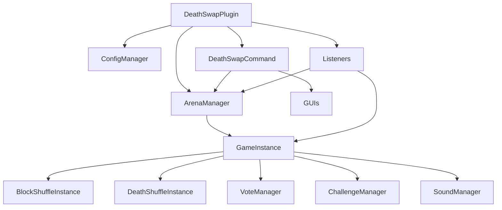
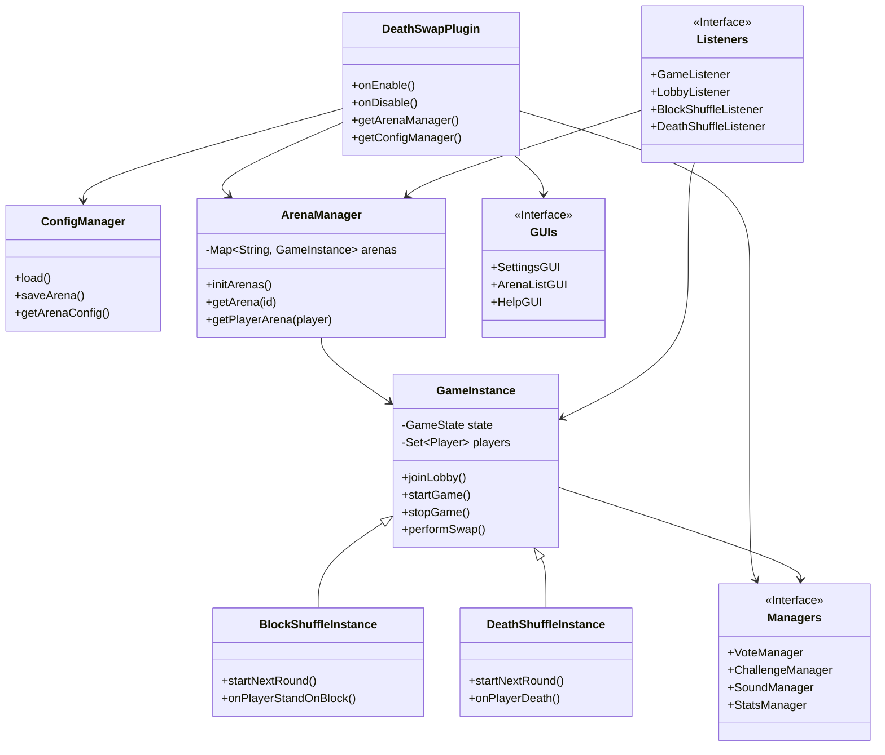

# 📖 DeathSwap — Complete Wiki

> **[Wiki Français](WIKI.md)**
>
> Comprehensive technical and user guide for the DeathSwap plugin.
> Last updated: February 2026
>
> ⚠️ **Current Limitations:**
> - In-game messages are available in **French** only.
> - **BlockShuffle** targets and **DeathShuffle** causes are hardcoded (not configurable at the moment).

---

## 📑 Table of Contents

1. [Installation and Prerequisites](#-installation-and-prerequisites)
2. [Getting Started](#-getting-started)
3. [Game Modes](#-game-modes)
4. [Full Commands](#-full-commands)
5. [Detailed Configuration](#-detailed-configuration)
6. [Permission System](#-permission-system)
7. [User Interface (UI Modes)](#-user-interface-ui-modes)
8. [Minecraft Gamerules](#-minecraft-gamerules)
9. [SEED System and Voting](#-seed-system-and-voting)
10. [Statistics and Leaderboards](#-statistics-and-leaderboards)
11. [Challenges](#-challenges)
12. [Custom Sounds](#-custom-sounds)
13. [Admin Dashboard](#-admin-dashboard)
14. [Multi-Arenas](#-multi-arenas)
15. [Dependencies](#-dependencies)
16. [FAQ and Troubleshooting](#-faq-and-troubleshooting)
17. [License](#-license)

---

## 📥 Installation and Prerequisites

### System Requirements

| Component | Minimum Version | Role |
|-----------|----------------|------|
| **Java** | 21+ | Runtime |
| **Paper** | 1.21+ | Minecraft Server |
| **Multiverse-Core** | 4.x | World management (creation, loading, TP) |
| **CyberWorldReset** | * | World regeneration (reset) |

### Installation Steps

```bash
# 1. Compile the plugin
mvn clean package

# 2. Copy the JAR to the plugins folder
cp target/deathswap-1.0.0.jar /path/to/server/plugins/

# 3. Start the server
# The config.yml file is auto-generated on first launch
```

### Initial Configuration Required

After the first launch:

1. **Create the worlds** via Multiverse:
   ```
   /mv create DS_WaitingLobby normal
   /mv create DeathSwap_Game normal
   ```
2. **Configure CyberWorldReset** for the game world:
   ```
   /cwr add DeathSwap_Game
   ```
3. **Edit** `plugins/DeathSwap/config.yml` to point to your worlds
4. **Reload** via `/ds reload`

---

## 🚀 Getting Started

### For Players

1. Join an arena: `/ds join` (or `/ds join <arena_name>`)
2. Wait for all players to be ready
3. The game starts automatically (or an admin forces it with `/ds start`)
4. Survive!

### For Admins

1. Open the dashboard: `/ds admin`
2. Click on an arena to manage it
3. Use `/ds reload` after every config change

---

## 🕹️ Game Modes

### DeathSwap (Classic)

> Trap the area before being swapped with another player!

- Players are **randomly teleported** to each other's positions
- Configurable swap interval (fixed or random)
- The last player alive wins
- **Optional PvP**, Configurable Nether/End

**Flow:**
1. 🏠 Lobby → All players click "Ready"
2. ⏳ Countdown + world loading
3. 🌍 Random dispersion in the world
4. ⚡ Spawn protection: Total invulnerability + Slow Falling + Fire Resistance (configurable)
5. 🔄 Swaps at regular intervals
6. 🏆 Last one standing is declared winner

### DeathShuffle

> Each round, a death type is assigned to you. Die the right way!

- Successive rounds with an assigned **death type**
- Examples: die from lava, fall damage, drowning, explosion...
- Timer per round based on difficulty (easy/medium/hard)
- If you don't die correctly → **eliminated**

**Death Types by Difficulty:**
| Easy | Medium | Hard |
|------|--------|------|
| Fall | Lava | Lightning |
| Drowning | Cactus | Wither |
| Fire | Explosion | Void |
| Mob | Arrow | Cramming |

### BlockShuffle

> Find and stand on the correct block before the timer runs out!

- Each round, a **block or item** is assigned
- Players must find and **stand on** that block
- Timer per round based on block rarity
- Last player is eliminated each round

### Simplified Architecture



### Full Class Diagram



---

## 📋 Full Commands

### Player Commands

| Command | Arguments | Description | Examples |
|---------|-----------|-------------|----------|
| `/ds join` | `[arena]` | Join an arena lobby. No argument = `default` arena | `/ds join`, `/ds join arena2` |
| `/ds leave` | — | Leave current game/lobby | `/ds leave` |
| `/ds list` | — | See all arenas, their status and players | `/ds list` |
| `/ds stats` | `[player]` | View your stats or another player's | `/ds stats`, `/ds stats Steve` |
| `/ds top` | `[category]` | Leaderboard. Categories: `wins`, `kills`, `deaths`, `time`, `games` | `/ds top`, `/ds top kills` |
| `/ds vote` | `<arena> <choice>` | Vote for a seed (triggered by in-game click) | `/ds vote default 2` |
| `/ds help gui` | — | Open the visual help menu with clickable items | `/ds help gui` |
| `/ds tp` | `<player>` | Teleport to a player (spectators only) | `/ds tp Steve` |

### Admin Commands

| Command | Arguments | Description | Examples |
|---------|-----------|-------------|----------|
| `/ds start` | `[debug]` | Start the game. `debug` = ignores min players | `/ds start`, `/ds start debug` |
| `/ds stop` | `[arena]` | Stop an arena. No argument = `default` | `/ds stop`, `/ds stop arena2` |
| `/ds swapnow` | — | Force an immediate swap (DeathSwap) | `/ds swapnow` |
| `/ds reload` | — | Reload full configuration | `/ds reload` |
| `/ds settings` | — | *(Reserved)* Arena Settings GUI | `/ds settings` |
| `/ds admin` | — | Open Admin Dashboard (GUI) | `/ds admin` |
| `/ds admin create` | `<name>` | Create a new arena | `/ds admin create arena2` |
| `/ds admin delete` | `<name>` | Delete an arena (with confirm) | `/ds admin delete arena2` |
| `/ds admin clone` | `<src> <dst>` | Clone an arena | `/ds admin clone default arena2` |
| `/ds admin list` | — | List arenas | `/ds admin list` |
| `/ds admin set` | `<arena> <prop> <val>` | Modify a property (lobby, game, type...) | `/ds admin set default lobby world_lobby` |
| `/ds admin gamerule` | `<arena> set/remove <rule> [val]` | Modify a gamerule | `/ds admin gamerule default set keepInventory true` |
| `/ds admin command` | `<arena> tp/reset <val>` | Modify TP/Reset command | `/ds admin command default tp mvtp %player% ...` |

> **Alias:** `/deathswap` also works instead of `/ds`

---

## ⚙️ Detailed Configuration

The `plugins/DeathSwap/config.yml` file controls 100% of the plugin's behavior.

### General Structure

```yaml
hub-world: "MainLobby"          # Return world after game/kick
teleport-command: "..."         # Teleport command
world-reset-commands: [...]     # Reset commands
prefixes: { ... }               # Chat prefixes per mode
stats: { ... }                  # Statistics
voting: { ... }                 # Voting system
challenges: { ... }             # Challenges (DeathSwap)
sounds: { ... }                 # Custom sounds
arenas:                         # All arenas
  default: { ... }
  arena2: { ... }
```

### `hub-world`

```yaml
hub-world: "MainLobby"
```

The name of the Multiverse world where players are sent after:
- Game end
- Arena kick
- `/ds leave` command

> ⚠️ This world **must exist** in Multiverse. Create it with `mv create MainLobby normal`.

### `teleport-command` & `world-reset-commands`

```yaml
teleport-command: "mvtp %player% e:%world%:%x%,%y%,%z%:%yaw%:%pitch%"
world-reset-commands:
  - "cwr edit %world% setSeed %seed%"
  - "cwr reset %world%"
```

- **`teleport-command`**: Command executed to teleport players.
  - **Default**: Uses Multiverse (`mvtp`).
  - **Vanilla**: `execute in %world% run tp %player% %x% %y% %z% %yaw% %pitch%`
- **`world-reset-commands`**: List of commands to reset the world.
  - **Default**: Uses CyberWorldReset (`cwr`).
  - **No Reset**: Leave the list empty `[]` to play on a static map.

### `gamerules`

```yaml
gamerules:
  keepInventory: "false"
  immediateRespawn: "true"
  doDaylightCycle: "true"
  doWeatherCycle: "true"
  mobGriefing: "true"
  naturalRegeneration: "true"
  doMobSpawning: "true"
  random_tick_speed: "3"        # Crop growth speed (3 = default)
  show_advancement_messages: "true" # Show advancements in chat
```

### `prefixes`

```yaml
prefixes:
  deathswap: "&8[&6DeathSwap&8]"
  deathshuffle: "&8[&dDeathShuffle&8]"
  blockshuffle: "&8[&bBlockShuffle&8]"
```

prefixes displayed in chat for each game mode. Supports Minecraft color codes (`&` notation).

### `stats`

```yaml
stats:
  enabled: true           # true = enable stats, false = disable
  auto-save-minutes: 5    # Auto-save every X minutes
```

- **`enabled`**: Enables/disables the full statistics system
- **`auto-save-minutes`**: Automatic save interval. Stats are also saved on server stop.

### `voting`

```yaml
voting:
  enabled: true           # Enable seed voting
  vote-time: 15           # Voting duration in seconds
  options-count: 3        # Number of seeds proposed in the vote
```

- **`vote-time`**: How long players have to vote (in seconds)
- **`options-count`**: Number of random seeds proposed from the `seeds` list

### `challenges`

```yaml
challenges:
  enabled: false
  list:
    - { type: CRAFT, target: CRAFTING_TABLE, amount: 1, reward: SPEED, description: "Craft a workbench" }
    - { type: MINE, target: COAL_ORE, amount: 3, reward: NIGHT_VISION, description: "Mine 3 coal" }
    - { type: KILL, target: ZOMBIE, amount: 1, reward: STRENGTH, description: "Kill a zombie" }
```

**DeathSwap mode only.** Challenges give bonus objectives with rewards.

| Parameter | Possible Values |
|-----------|-----------------|
| `type` | `CRAFT`, `MINE`, `KILL` |
| `target` | Bukkit Material/EntityType name (e.g., `IRON_ORE`, `ZOMBIE`, `FURNACE`) |
| `amount` | Required amount (integer) |
| `reward` | Potion effect: `SPEED`, `STRENGTH`, `NIGHT_VISION`, `RESISTANCE`, `FASTER_DIGGING` |
| `description` | Text displayed to the player |

### `sounds`

```yaml
sounds:
  enabled: true
  game-start: { type: "ENTITY_ENDER_DRAGON_GROWL", volume: 1.0, pitch: 1.0 }
  swap: { type: "ENTITY_ENDERMAN_TELEPORT", volume: 1.0, pitch: 1.0 }
  # ... etc
```

Each sound event is individually configurable.

| Key | When it plays |
|-----|--------------|
| `game-start` | Game starts |
| `countdown-tick` | Each countdown second |
| `countdown-go` | Countdown end, GO! |
| `swap` | Swap between players (DeathSwap) |
| `shuffle` | New round (DeathShuffle/BlockShuffle) |
| `death` | A player dies |
| `win` | A player wins the game |
| `round-success` | Round succeeded (Shuffle modes) |
| `round-fail` | Round failed (Shuffle modes) |
| `challenge-complete` | Challenge completed |
| `vote-cast` | Vote cast |

**Parameters:**
- `type`: Bukkit Sound name (e.g., `ENTITY_ENDERMAN_TELEPORT`). See [full list](https://hub.spigotmc.org/javadocs/bukkit/org/bukkit/Sound.html)
- `volume`: Volume (0.0 to 2.0)
- `pitch`: Pitch (0.5 to 2.0). `1.0` = normal

To **disable all sounds**: `sounds.enabled: false`

### `arenas`

Each block under `arenas:` defines an independent arena.

```yaml
arenas:
  default:              # Unique Arena ID
    game-type: DEATHSWAP
    game-world: "DeathSwap_Game"
    lobby-world: "DS_WaitingLobby"
    min-players: 2
    max-players: 20
    ui-mode: RICH
    timers: { ... }
    round-timers: { ... }
    game: { ... }
    gamerules: { ... }
    seeds: [ ... ]
```

#### Arena Parameters

| Parameter | Type | Default | Description |
|-----------|------|---------|-------------|
| `game-type` | Enum | `DEATHSWAP` | Game mode: `DEATHSWAP`, `DEATHSHUFFLE`, `BLOCKSHUFFLE` |
| `game-world` | String | `DeathSwap_Game` | Multiverse world name for the game |
| `lobby-world` | String | `DS_WaitingLobby` | Multiverse world name for the lobby |
| `min-players` | Int | `2` | Minimum players to start |
| `max-players` | Int | `20` | Maximum players accepted |
| `ui-mode` | Enum | `RICH` | Display mode: `RICH` or `CLEAN` |
| `start-if-min-players-met` | Boolean | `false` | If `true`, ignores "Not Ready" if min-players reached |
| `prevent-cancel-after-countdown` | Boolean | `false` | If `true`, countdown continues even if someone quits (as long as >= min) |

#### `timers` (DeathSwap)

| Parameter | Type | Default | Description |
|-----------|------|---------|-------------|
| `load-time` | Int (sec) | `40` | World load time before game |
| `swap-mode` | Enum | `FIXED` | `FIXED` = fixed interval, `RANDOM` = random |
| `swap-interval` | Int (sec) | `300` | Swap interval in FIXED mode (5 min) |
| `swap-min` | Int (sec) | `120` | Minimum interval in RANDOM mode (2 min) |
| `swap-max` | Int (sec) | `420` | Maximum interval in RANDOM mode (7 min) |
| `max-game-time` | Int (sec) | `1800` | Max game duration (30 min) |
| `spawn-protection` | Int (sec) | `30` | Invulnerability at start |

#### `round-timers` (DeathShuffle / BlockShuffle)

| Parameter | Type | Default | Description |
|-----------|------|---------|-------------|
| `easy` | Int (sec) | `90` | Easy round duration |
| `medium` | Int (sec) | `70` | Medium round duration |
| `hard` | Int (sec) | `50` | Hard round duration |

#### `game`

| Parameter | Type | Default | Description |
|-----------|------|---------|-------------|
| `pvp-enabled` | Boolean | `true` | PvP enabled between players |
| `nether-enabled` | Boolean | `false` | Nether access allowed |
| `end-enabled` | Boolean | `false` | End access allowed |

#### `gamerules`

```yaml
gamerules:
  keepInventory: "false"
  immediateRespawn: "true"
  doDaylightCycle: "true"
  doWeatherCycle: "true"
  mobGriefing: "true"
  naturalRegeneration: "true"
  doMobSpawning: "true"
```

Applied to the game world at game start. All Minecraft gamerules are supported. Values in quotes (`"true"` / `"false"`).

> 💡 Gamerules are also editable **in-game** via the Gamerules GUI (accessible from Settings).

#### `seeds`

```yaml
seeds:
  - { seed: "-3542283819777", name: "Temple & Village" }
  - { seed: "123456789", name: "Survival Island" }
```

List of predefined seeds for voting. Each entry has:
- `seed`: The Minecraft seed (as string)
- `name`: Name displayed to the player during voting

---

## 🔐 Permission System

| Permission | Description | Default | Associated Commands |
|------------|-------------|---------|---------------------|
| `deathswap.play` | Basic player access | `true` (everyone) | `join`, `leave`, `list`, `stats`, `top`, `vote`, `tp` |
| `deathswap.admin` | Full admin access | `op` | `start`, `stop`, `swapnow`, `reload`, `settings`, `admin` |

### LuckPerms Integration (example)

```
/lp group moderator permission set deathswap.admin true
/lp group default permission set deathswap.play true
```

---

## 🎨 User Interface (UI Modes)

### RICH Mode (default)

| Element | Display |
|---------|---------|
| Swap timer | **BossBar** at top of screen (yellow animated bar) |
| Round info | **ActionBar** (text above hotbar) |
| Major events | Full screen **Title** (swap, death, win) |
| System messages | Chat |

### CLEAN Mode

| Element | Display |
|---------|---------|
| Swap timer | Periodic chat message |
| Round info | Chat message |
| Major events | Colored chat message |
| System messages | Chat |

### How to change mode

**Via config:**
```yaml
arenas:
  default:
    ui-mode: CLEAN    # or RICH
```

**Via in-game GUI:**
The Settings GUI (accessible from Admin Dashboard or `/ds settings`) allows switching between the two modes.

---

## 🎮 Minecraft Gamerules

Gamerules are Minecraft rules applied to the game world. They are configurable in two ways:

### Via config.yml

```yaml
arenas:
  default:
    gamerules:
      keepInventory: "false"
      naturalRegeneration: "true"
      # Any valid Minecraft gamerule
```

### Via in-game GUI

1. Open Admin Dashboard (`/ds admin`)
2. Middle-click on the arena → Settings GUI
3. Navigate to "Gamerules"
4. Click to toggle each rule

---

## 🗳️ Seed System and Voting

### How it works

1. When all players are ready, a **vote** opens (if enabled)
2. The system picks `options-count` random seeds from the list
3. Players see options in chat and click to vote
4. After `vote-time` seconds, the winning seed is applied
5. The world is generated with this seed

### Configuration

```yaml
voting:
  enabled: true
  vote-time: 15      # Voting duration
  options-count: 3    # Number of options

arenas:
  default:
    seeds:
      - { seed: "12345", name: "Village + Temple" }
      - { seed: "-99999", name: "Infinite Desert" }
      # Add as many seeds as you want
```

---

## 📊 Statistics and Leaderboards

### Tracked Player Stats

| Stat | Description |
|------|-------------|
| **Wins** (`wins`) | Number of games won |
| **Kills** (`kills`) | Total number of kills |
| **Deaths** (`deaths`) | Number of deaths |
| **Play Time** (`time`) | Total time in game (seconds) |
| **Games** (`games`) | Number of games played |

### View Your Stats

```
/ds stats           → Your own stats
/ds stats Steve     → Steve's stats
```

### Leaderboards

```
/ds top             → Top 10 wins (default)
/ds top kills       → Top 10 kills
/ds top deaths      → Top 10 deaths
/ds top time        → Top 10 play time
/ds top games       → Top 10 games played
```

### Storage

Stats are saved in YAML in `plugins/DeathSwap/stats/`. Auto-save is configurable via `stats.auto-save-minutes`.

---

## 🎯 Challenges

> DeathSwap mode only. Disabled by default.

Challenges are bonus objectives that give **potion effects** as rewards.

### Challenge Types

| Type | Objective | Example |
|------|-----------|---------|
| `CRAFT` | Craft an item | Craft a crafting table |
| `MINE` | Mine a block | Mine 3 coal |
| `KILL` | Kill a mob | Kill a zombie |

### Available Rewards

| Reward | Effect |
|--------|--------|
| `SPEED` | Speed |
| `STRENGTH` | Strength |
| `NIGHT_VISION` | Night Vision |
| `RESISTANCE` | Resistance |
| `FASTER_DIGGING` | Haste |

### Add a Challenge

```yaml
challenges:
  enabled: true
  list:
    # Format: { type: TYPE, target: MATERIAL/ENTITY, amount: N, reward: EFFECT, description: "text" }
    - { type: CRAFT, target: DIAMOND_PICKAXE, amount: 1, reward: STRENGTH, description: "Craft a diamond pickaxe" }
    - { type: MINE, target: DIAMOND_ORE, amount: 5, reward: SPEED, description: "Mine 5 diamonds" }
    - { type: KILL, target: ENDERMAN, amount: 3, reward: NIGHT_VISION, description: "Kill 3 endermen" }
```

---

## 🔊 Custom Sounds

Every game event can have a custom sound. Full Bukkit sound list available on [Spigot docs](https://hub.spigotmc.org/javadocs/bukkit/org/bukkit/Sound.html).

### Customizing a Sound

```yaml
sounds:
  swap: { type: "ENTITY_GHAST_SCREAM", volume: 0.5, pitch: 1.5 }
```

- **`volume`**: from `0.0` (silent) to `2.0` (loud)
- **`pitch`**: from `0.5` (deep) to `2.0` (high). `1.0` = normal

---

## 🛠️ Admin Dashboard

The Admin Dashboard is a GUI system accessible via `/ds admin`. It provides a full graphical interface to manage arenas and players.

### Access

- **Command:** `/ds admin`
- **Permission required:** `deathswap.admin`
- **Player only** (no console)

### Dashboard Pages

#### 1. Main Page (Arena List)

| Element | Action |
|---------|--------|
| **Arena Item** (colored concrete) | Shows status and player count |
| **Left Click** on arena | → Open arena details |
| **Right Click** on arena | → Teleport to arena lobby (Shift+Left Click) |
| **Middle Click** on arena | → Open Settings GUI (Shift+Right Click) |
| **Nether Star** | Reload all configuration |
| **Barrier** | Close GUI |

### 🛠️ In-Game Configuration (Settings GUI)

Accessible via **Middle Click** (or Shift+Right Click) on an arena in the Dashboard, or via `/ds settings`.
This menu allows modifying **all** aspects of the arena without touching the `config.yml` file:

- **Worlds**: Change Lobby and Game worlds (keyboard input in chat)
- **Game Mode**: Switch between DeathSwap, DeathShuffle, BlockShuffle
- **Gamerules**: Enable/Disable rules (KeepInventory, etc.)
- **Timers**: Adjust swap times, max game time, etc.
- **Commands**: Configure TP command (Multiverse/Vanilla) and Reset command (CWR/Multiverse)
- **Resilience**: Enable robust start options

**Status Colors:**

| Color | State |
|-------|-------|
| 🟡 Yellow | `WAITING` — Waiting for players |
| 🟢 Light Green | `STARTING` — World loading & players are invulnerable |
| 🟩 Green | `RUNNING` — Game running (after spawn protection) |
| 🔴 Red | `ENDED` — Game ended |
| ⬛ Barrier | `DISABLED` — Arena disabled |

#### 2. Arena Details

| Button | Action |
|--------|--------|
| ⚔️ **Force Start** | Starts game immediately (visible if WAITING/STARTING) |
| 🛑 **Force Stop** | Stops the game (visible if RUNNING) |
| 💥 **Regenerate World** | Reset world via CyberWorldReset (only if game not running) → **⚠ Confirmation required** |
| 👥 **Manage Players** | → Opens player list |
| ⬅️ **Back** | → Back to main page |

#### 3. Player List

Shows all players in the arena with their **head**, **health** (❤) and **hunger** (🍗).

| Action | Result |
|--------|--------|
| **Left Click** on a player | → Open actions for this player |
| **⬅️ Back** | → Back to arena details |

#### 4. Player Actions

| Button | Action | Description |
|--------|--------|-------------|
| 🔮 **Teleport** | `admin.teleport(target)` | TP admin to player |
| 📦 **View Inventory** | `admin.openInventory(target)` | View/modify inventory |
| 👢 **Kick from Arena** | `arena.sendToHub(target)` | Send back to hub |
| ⛔ **Ban** | `sendToHub` + `/ban` → **⚠ Confirmation required** |
| ⬅️ **Back** | — | Back to player list |

#### 5. Confirmation Screen

Destructive actions (**Regenerate World** and **Ban**) pass through a confirmation screen to avoid mistakes.

| Slot | Item | Action |
|------|------|--------|
| 11 | 🟩 **Green Wool** | **Cancel** — return to previous screen |
| 13 | 💥 **TNT** | Info: action name + description + ⚠ "This action is irreversible!" |
| 15 | 🟥 **Red Wool** | **Confirm** — executes action |

---

## 🏟️ Multi-Arenas

### Concept

Each arena is an **independent instance** with:
- Its own game world
- Its own lobby
- Its own configuration (mode, timers, seeds, etc.)
- Its own players

### Adding an Arena

1. **Create the worlds**:
   ```
   /mv create MyArena_Game normal
   /mv create MyArena_Lobby normal
   /cwr add MyArena_Game
   ```

2. **Add in config.yml**:
   ```yaml
   arenas:
     default:
       # ... existing arena ...
     
     my_arena:
       game-type: DEATHSHUFFLE
       game-world: "MyArena_Game"
       lobby-world: "MyArena_Lobby"
       min-players: 3
       max-players: 8
       ui-mode: CLEAN
       timers:
         load-time: 30
         swap-mode: RANDOM
         swap-min: 60
         swap-max: 300
       round-timers:
         easy: 120
         medium: 90
         hard: 60
       game:
         pvp-enabled: false
         nether-enabled: true
         end-enabled: false
       seeds:
         - { seed: "42", name: "The Answer" }
   ```

3. **Reload**: `/ds reload`
4. **Join**: `/ds join my_arena`

### Deleting an Arena

1. Remove the block in `config.yml`
2. `/ds reload`
3. Optional: delete worlds via Multiverse (`/mv delete MyArena_Game`)

---

## 🔧 Dependencies

### Multiverse-Core (required)

Used for:
- Creating and loading worlds (`mv create`, `mv load`)
- Teleporting players (`mv tp`)
- Managing lobby and game worlds

### CyberWorldReset (optional)

Used for:
- Regenerating game worlds between games (`cwr reset`)
- Available from the "Regenerate" button in Admin Dashboard

### CyberWorldReset Configuration

1. Install CyberWorldReset
2. Add the game world:
   ```
   /cwr add DeathSwap_Game
   ```
3. The `cwr reset <world>` command will be used automatically by the Admin Dashboard

---

## ❓ FAQ and Troubleshooting

### Plugin does not start

- Check that Java 21+ is installed (`java -version`)
- Check that Paper 1.21+ is used
- Check console logs for errors

### Worlds do not load

- Check that **Multiverse-Core** is installed and active
- Check world names in `config.yml` match those in Multiverse
- Use `/mv list` to see available worlds

### Swap does not work

- Check that `timers.swap-mode` is `FIXED` or `RANDOM`
- In `RANDOM` mode, check that `swap-min` < `swap-max`
- Check that there are at least 2 players alive

### Stats are not saving

- Check that `stats.enabled: true` in `config.yml`
- Check write permissions for `plugins/DeathSwap/stats/` folder

### Regeneration does not work

- Check that **CyberWorldReset** is installed
- Check that the world is added: `/cwr add <world_name>`
- Regeneration does not work if a game is running

---

## 📂 Reference Configuration Files

### Default `config.yml`
```yaml
# DeathSwap Global Configuration
# ------------------------------

# The world where players are sent after a game ends
hub-world: "MainLobby"

# Command used to teleport players to lobbies/hubs.
# Placeholders: %player%, %world%, %x%, %y%, %z%, %yaw%, %pitch%
# Default (Multiverse): "mvtp %player% e:%world%:%x%,%y%,%z%:%yaw%:%pitch%"
# Vanilla Example: "execute in %world% run tp %player% %x% %y% %z% %yaw% %pitch%"
teleport-command: "mvtp %player% e:%world%:%x%,%y%,%z%:%yaw%:%pitch%"

# Commands used to reset the game world before a match.
# Placeholders: %world%, %seed%
# Leave empty [] to disable world resetting (for static maps).
world-reset-commands:
  - "cwr edit %world% setSeed %seed%"
  - "cwr reset %world%"

prefixes:
  deathswap: "&c[DS]"
  deathshuffle: "&6[DSh]"
  blockshuffle: "&b[BS]"

stats:
  enabled: true
  auto-save-minutes: 5

sounds:
  enabled: true
  # Define custom sounds here if needed

challenges:
  enabled: true
  list:
    - type: CRAFT
      target: CRAFTING_TABLE
      amount: 1
      reward: SPEED
      description: "Craft a Workbench!"

voting:
  enabled: true
  vote-time: 30
  options-count: 3
```

### Example Arena (`arenas/example.yml`)
> **Note:** Copy this file to create new arenas (e.g., `myarena.yml`). The plugin ignores `example.yml`.

```yaml
game-type: DEATHSWAP
game-world: "example_Game"
lobby-world: "example_Lobby"
min-players: 2
max-players: 20
ui-mode: RICH

timers:
  load-time: 40
  swap-mode: FIXED
  swap-interval: 300
  swap-min: 120
  swap-max: 420
  max-game-time: 1800
  spawn-protection: 30

round-timers:
  easy: 90
  medium: 70
  hard: 50

game:
  pvp-enabled: true
  nether-enabled: true
  end-enabled: true

gamerules:
  keep_inventory: "false"
  immediate_respawn: "true"
  do_daylight_cycle: "true"
  do_weather_cycle: "true"
  mob_griefing: "true"
  natural_regeneration: "true"
  do_mob_spawning: "true"
  send_command_feedback: "false"
  log_admin_commands: "false"
  respawn_radius: "0"

seeds: []
```

---

## 📜 License

This project is under a **custom license**.
See the [LICENSE.md](LICENSE.md) file for full details.

* **Usage and Modification**: Free (private or public).
* **Redistribution**: Allowed with mandatory credit.
* **Commercial Use**: Strictly prohibited without prior agreement.
